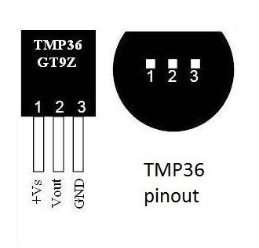

TMP36GZ
=================

Calculating temperatur using the TMP36GZ in python

| Board pin name | Board pin | Beaglebone Black pin name |
|----------------|-----------| --------------------------|
| +Vs            | 1         | P9\_05, VDD\_5v           |
| Vout           | 2         | P9\_40, AIN1              |
| GND            | 3         | P9\_1, Ground             |

